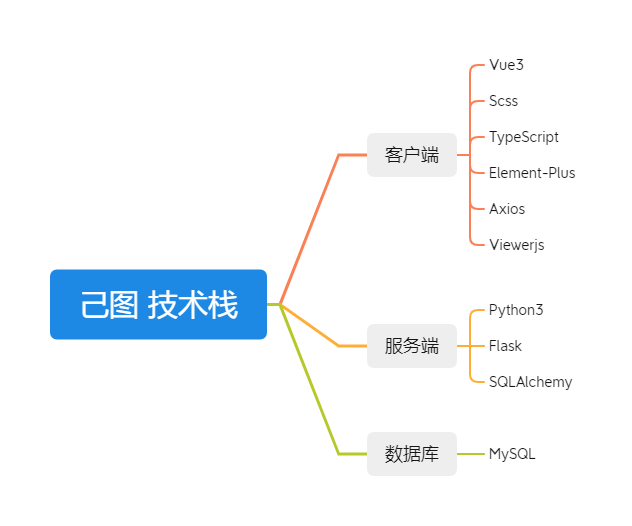
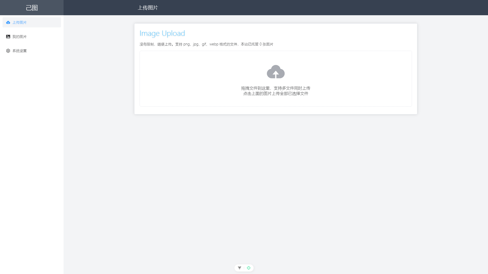
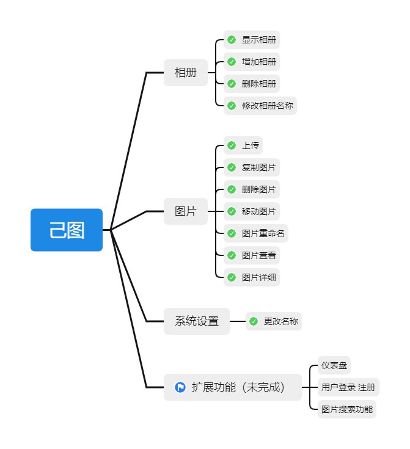

# JiTu


名称：JiTu / 己图

作者：KSaMar

日期：2025/2/10-2025/2/13

描述：Windows系统下 一个简易的 Web 本地运行图库管理系统

标签：个人，图库，本地服务

API文档：[API](https://apifox.com/apidoc/shared-99a6319e-46c1-449f-ac71-6e310c1072cf)

## 开发环境

前端

开发软件：VS Code

Node 版本：18.16.0

后端

开发软件：PyCharm 2023.2.3

Python 版本: 3.7.4

Python 需要的包：Flask PyYAML PIL

数据库版本：MySQL 5.7.26


## 技术栈

项目采用以下技术：

Vue3 + Element-Plus + Python + Flask



## 项目介绍

本项目是基于 Windows 系统下制作的一款 BS 架构的建议图库应用，用户可以使用本地电脑搭建一个自己的图库管理系统。

功能模块：图片上传、相册管理、图片管理、图片详情查看、系统设置等

原理：基于 Python os 模块 Windows 文件夹操作，将图片信息处理后存储至 MySQL 后，再由服务端返回信息给前端页面进行展示


## 项目图片

### 上传图片页面



### 我的图片页面


## 项目功能



## 项目部署

如果你需要二次开发，请使用以下方式

前端文件

```
pnpm install
pnpm format
pnpm run dev
```

后端文件

```
python app.py
```


如果你想直接使用，可以访问 [releases](https://github.com/baobaoJK/JiTu/releases/tag/office) 进行下载

请在电脑上安装 NGINX 或 Apache 服务以确保前端页面能访问

请在电脑上安装 MySQL 服务以确保后端服务能够运行


如果你想在第二台电脑上使用该服务，请使用 mkcert 生成 SSL 证书

并将生成后的证书放置在前端与后端服务的 keys 文件夹下

[mkcert使用方式](jitu-info/how-to-use-mkcert.md)

## Bilibili

欢迎在哔哩哔哩上关注我

[Bilibili](https://space.bilibili.com/51110915)
