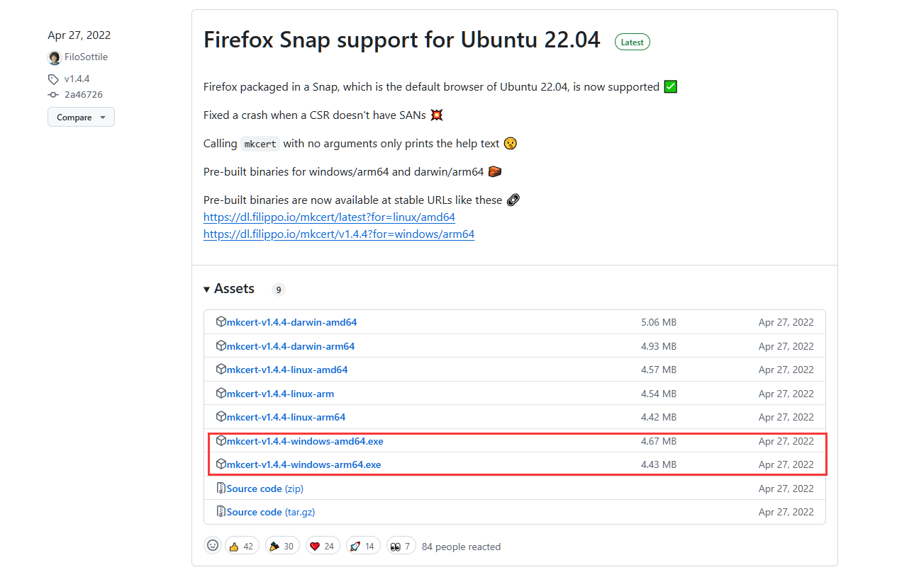
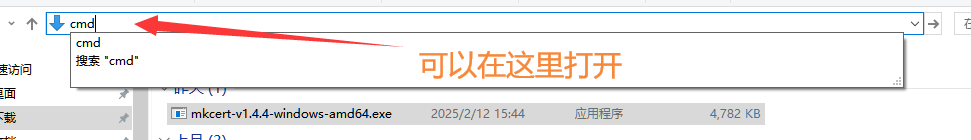
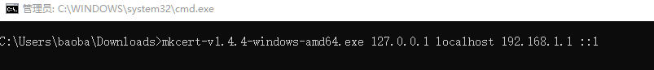
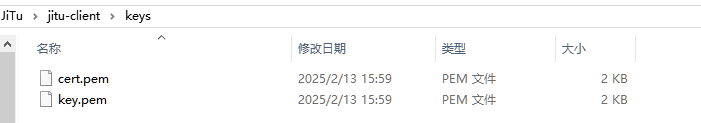

# 如何使用 Mkcert？

首先前往 Mkcert GitHub releases 地址 [点我](https://github.com/FiloSottile/mkcert/releases)

下载 mkcert.exe



你的电脑能用那个用那个

下载完毕之后，去到你下载好的 mkcert 的目录打开 Cmd 窗口



然后输入命令生成 SSL 证书



```
mkcert-v1.4.4-windows-amd64.exe 127.0.0.1 localhost 192.168.1.1 ::1
```

上面的 129.168.1.1 需要替换为你的本机地址，否则无法使用本机地址访问 HTTPS 链接

最后将生成的文件放入keys文件夹下即可

